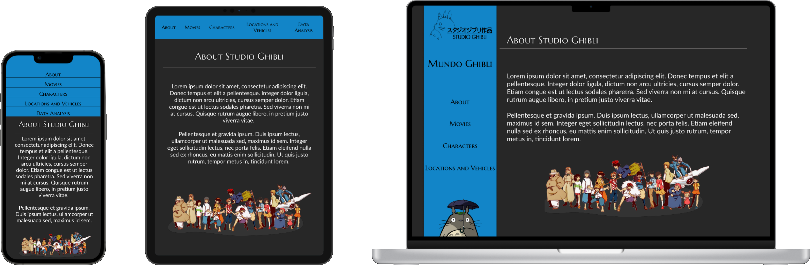

# **Ghibli Lovers**

 
 
 
 
  
  
 

## **Índice**

* [1. Apresentação](#1-apresentação)
* [2. Studio Ghibli](#2-studio-ghibli)
  * [2.1 Achados](#21-achados)
* [3. Idealização do Projeto](#3-idealização-do-projeto)
* [4. Desenho de interface do usuário](#4-desenho-de-interface-do-usuário)
  * [4.1 Protótipo de alta fidelidade](#41-protótipo-de-alta-fidelidade)
* [5. Hacker edition](#5-hacker-edition)
* [6. Estrutura de apresentação](#6-estrutura-de-apresentação)
* [7. Checklist](#7-checklist)

***
## **1. Apresentação**

Projeto construido ao longo do Bootcamp de Desenvolvimento Web e UX Design da [Laboratória](https://hub.laboratoria.la/br/10-coisas-que-voce-precisa-saber-sobre-o-bootcamp). Este projeto apresenta o universo dos Studio Ghibli a partir de 20 longas, suas sinopses, informação de personagens, locais e veículos únicos. Na página é possível filtrar os filmes por direção, ordená-los por ano de produção e nota de avaliação, que possibilitará uma visão geral dos filmes que possuem uma maior aceitação pelo público. Além de filtrar personagens por filme e por espécie. Ao final também é possível verificar um dashboard com alguns gráficos pontuais sobre as espécies existentes nesse universo e ritmo de produção ao longo dos anos.

**Acesse o resultado final [aqui](https://dashboard-ghibli.netlify.app/#)!!!**

## **2. Studio Ghibli**

Studio Ghibli é um estúdio japonês de animação, muito
conhecido por seus filmes como **Meu Amigo Totoro**,
**A Viagem de Chihiro**, **O Castelo Animado**, entre outros grandes sucessos.
As animações são bem recebidas em todo o mundo e algumas receberam
várias nomeações e prêmios. De todo esse fandom há um grupo que deseja
interagir e ver as informações das animações e seus personagens.

### 2.1 Achados

Para entender melhor quais informações nossos usuários podem precisar,
fizemos uma investigação rápida (research) e essas são algumas das conclusões.

- Studio Ghibli tem várias animações e para nossos usuários é importante
saber quantas e quais são
- As mentes por trás de cada animação são os diretores e produtores,
sendo que eles podem ter contribuído
na criação de mais de uma obra. Portanto, é importante
para nosso usuário poder conhecê-los e saber quantas e quais são as criações
em que eles trabalharam
- As animações possuem informações relevantes para nossos usuários, como
descrição, data de lançamento, diretor, produtor e personagens
- Cada animação tem seus personagens e para nossos usuários é importante
saber quantos e quais são
- Os personagens têm características únicas que o usuário deseja conhecer, como
nome, idade, sexo, espécie, etc.
- As animações têm locais e veículos únicos em cada um e para nossos usuários é
importante saber quais são
- Além dessas informações, é importante que nossos usuários sejam capazes de
ver os tipos de espécies em cada animação

## **3. Idealização do Projeto**

O primeiro passo foi entender como os nossos dados estavam estruturados, neste caso um array de objetos, nos quais alguns valores também eram compostos de array de outros objetos. Ou seja, para alcançar algumas informações precisaríamos entender como realizar iterações em arrays de objetos, e em alguns casos, realizar iterações dentro de iterações para acessar dados em array alocados em valores de objetos. 

- Object Studio Ghibli:
  - Films => cada *film* um objeto que entre suas propriedades possui:
    - People => cada *people* um objeto
    - Location => cada *location* um objeto
    - Vehicles => cada *vehicle* um objeto

## **4. Desenho de interface do usuário**

### 4.1 Protótipo de alta fidelidade

## **5. Hacker edition**

As seções chamadas _Hacker Edition_ são **opcionais**. Se já tiver terminado
todos os requisitos anteriores e tiver tempo, pode tentar completá-las. Dessa
forma, você pode aprofundar e/ou exercitar mais os objetivos de aprendizagem
deste projeto.

Features/características extra sugeridas:

* Ao invés de consumir dados estáticos do repositório, pode fazer isso de forma
  dinâmica, carregando um arquivo JSON com `fetch`. A pasta `src/data` contém
  uma versão `.js` e uma `.json` de cada conjunto de dados.
* Adicione à sua interface visualização de dados em forma de gráficos. Para
  isso, recomendamos explorar bibliotecas de gráficos como
  [Chart.js](https://www.chartjs.org/) ou [Google
  Charts](https://developers.google.com/chart/).
* 100% de cobertura nos testes.

***

## **6. Estrutura de apresentação**

De modo a atender *histórias de usuários* mais detalhadas, assim como tornar a navegabilidade mais fluída optei por dividir as informações (filmes, personagens e veículos/locais) da seguinte maneira:

- 🏠 **About** com uma breve introdução do Sthudio Ghbli e uma apresentação de dados numérico sobre os dados apresentados, tais como a quantidade de filmes, personagens, veículos e locais apresentados nas páginas seguintes.

- 🎬 **Movies:** apresenta os 20 longas presentes na base de dados e ao clicar em cada um dos banners é possível adquirir informações como sinopse do filme, direção, tempo de duração, nota e quantidade de personagens envolvidos na história. Nessa página é possível ordernar os filmes por nota de avaliação de forma decrescente e filtra-los por tempo de duração.

- 🦸🏾‍♀️ **Characters:** apresenta informações sobre personagens do filme escolhidos, tais como: foto, nome, gênero, idade e raça.

- 🛩️🏞️ **Locations and Vehicles:** apresenta os locais descritos onde os filmes estão ambientados e os veículos particulares adotados em alguns desses filmes com foto, nome do filme e nome do local/veículo. Nessa página é possível filtrar a visualização apenas por veículos ou por locais.

## **7. Checklist**

* [ ] Usar VanillaJS.
* [ ] Passa pelo linter (`npm run pretest`)
* [ ] Passa pelos testes (`npm test`)
* [ ] Testes unitários cobrem um mínimo de 70% de statements, functions, lines e
  branches.
* [ ] Inclui uma _definição de produto_ clara e informativa no `README.md`.
* [ ] Inclui histórias de usuário no `README.md`.
* [ ] Inclui rascunho da solução (protótipo de baixa fidelidade) no `README.md`.
* [ ] Inclui uma lista de problemas detectados nos testes de usabilidade no
  `README.md`.
* [ ] UI: Mostra lista/tabela/etc com dados e/ou indicadores.
* [ ] UI: Permite ordenar dados por um ou mais campos (asc e desc).
* [ ] UI: Permite filtrar dados com base em uma condição.
* [ ] UI: É _responsivo_.
* [ ] UI: É uma SPA.

## **8. Fontes**

* [Imagem do Totoro](https://www.hiclipart.com/free-transparent-background-png-clipart-iitvw)
* [Logo Studio Ghibli](https://www.ghibli.jp/)
* [Personagens reunidos (about)](https://www.hiclipart.com/free-transparent-background-png-clipart-yknzp)
* [Repositório do projeto original - Laboratória](https://github.com/Laboratoria/SAP008-data-lovers)
